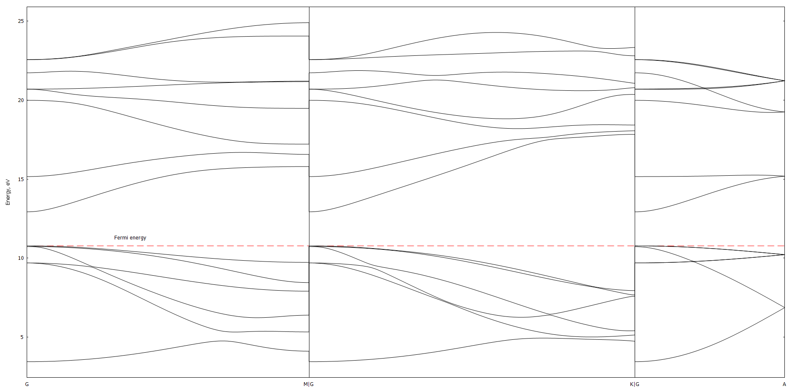
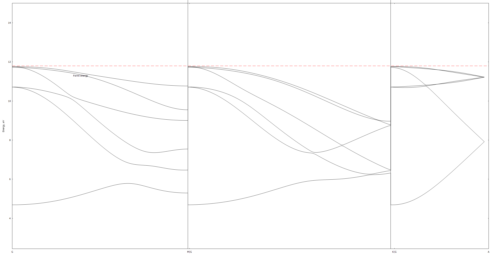
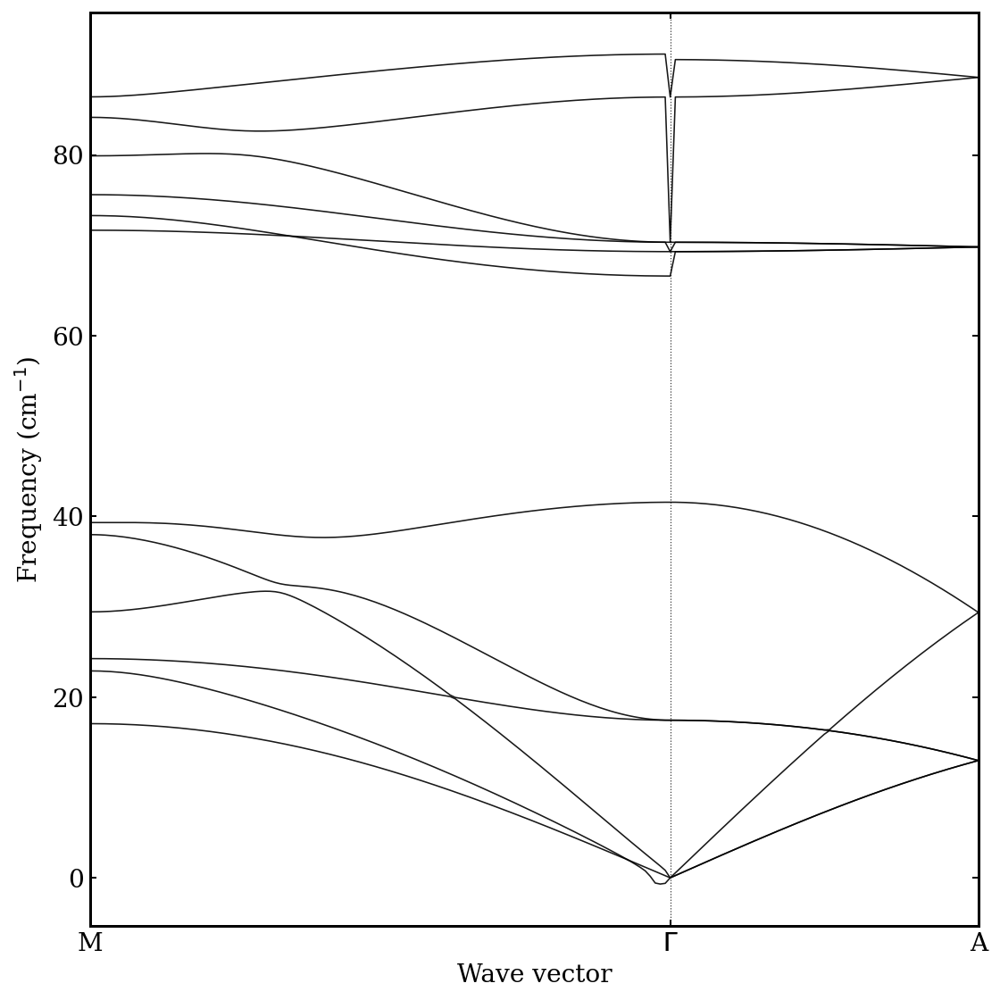
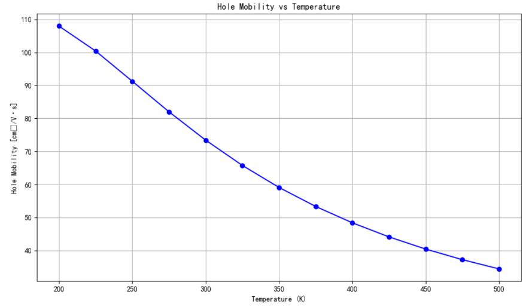
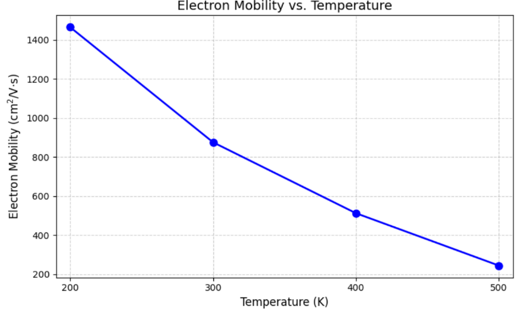

# Ab initio modeling of GaN: phonon-limited carrier mobility with Quantum ESPRESSO and EPW

First-principles calculation of the electronic structure, phonon dispersion and phonon-limited
electron and hole mobility of bulk wurtzite GaN. The workflow runs through Quantum ESPRESSO:
variable-cell relaxation, self-consistent DFT, density-functional perturbation theory for the
phonons and the electron–phonon matrix elements on coarse grids, Wannier interpolation of both
to fine grids with the EPW module, and an iterative solution of the Boltzmann transport equation
for the temperature-dependent mobility. The complete set of input files, job scripts and
pseudopotentials for the LDA calculation and for a later PBE rerun is included, together with
the interpolated band and phonon data, the converged mobility output and the figures. The
write-up is in [`report.pdf`](report.pdf).



## Background

GaN is a wide-bandgap III–V semiconductor with a direct gap of about 3.4 eV [1] and the
material of choice for high-power and high-frequency devices, whose switching characteristics
are governed by carrier mobility. Phonon scattering sets the intrinsic upper limit of that
mobility, and computing it from first principles requires the electron–phonon coupling across
the whole Brillouin zone, far beyond what DFPT can afford directly. The EPW method [2, 3]
solves this by transforming the matrix elements computed on a coarse grid into a basis of
maximally localised Wannier functions, where they are short-ranged in real space, and
interpolating them to arbitrarily fine grids. The mobility then follows from the Boltzmann
transport equation [4]. Such intrinsic mobilities are the kind of input parameter that
technology computer-aided design of devices relies on.

## What is in the repository

| path | purpose |
|---|---|
| `relax/` | variable-cell relaxation of the wurtzite cell (`varicell.in`, job script, ONCV LDA pseudopotentials). |
| `lda/` | the LDA workflow: `scf.in`, `ph.in`, `nscf.in`, the EPW post-processing script `pp.py` that collects the phonon output into `save/`, the three EPW inputs (`epw1.in` Wannierization and band/phonon interpolation, `epw2.in` hole mobility, `epw3.in` electron mobility), the M–Γ–A path `MGA.txt`, the Slurm job scripts and the ONCV LDA pseudopotentials. |
| `pbe/` | the same workflow with ONCV PBE pseudopotentials. |
| `results/lda/` | Wannier-interpolated bands along Γ–M, Γ–K, Γ–A (`gan_band.dat`, `.kpt`, `.labelinfo.dat`, `.gnu`), EPW bands and phonons along M–Γ–A (`band.eig`, `phband.freq`), the converged hole-mobility output (`epw_hole_mobility.out`) and the figures. |
| `results/pbe/` | interpolated bands and phonons from the PBE rerun and its band-structure figure. |
| `plot_phonon_dispersion.py` | plots `phband.freq` along the path. |
| [`report.pdf`](report.pdf) | the report: theory, implementation, results and discussion. |

Run-time output (wavefunctions, charge density, `dvscf` files, roughly 130 MB per run) is not
included.

## Method

Wannier functions are Fourier transforms of the Bloch states over the Brillouin zone [3],

|w_nR⟩ = (V_cell / (2π)³) ∫_BZ e^{−ik·R} |ψ_nk⟩ d³k,

localised at the lattice vectors R, so that Hamiltonian and electron–phonon matrix elements
expressed in this basis decay with |R| and can be interpolated. The coupling of an electron in
band n at k to band m at k + q through phonon mode ν is

g_mnν(k, q) = ⟨ψ_mk+q | ∂_qν V | ψ_nk⟩,

with ∂_qν V the DFPT perturbing potential. EPW computes g on the coarse grids, rotates it into
the Wannier basis, Fourier transforms it in both k and q, and interpolates it back onto fine
grids [2]. The electron–phonon scattering rate follows from Fermi's golden rule with phonon
emission and absorption,

1/τ_nk = (2π/ħ) Σ_mqν |g_mnν(k, q)|² [(1 − f_mk+q)(n_qν + 1) δ(ε_nk − ε_mk+q − ħω_qν) + …],

and the mobility from the Boltzmann transport equation, which EPW solves iteratively beyond
the relaxation-time approximation [4]. For a polar crystal the long-range (Fröhlich) part of
the coupling and the LO–TO splitting at Γ are treated separately through the dielectric tensor
and Born effective charges (`epsil` in `ph.x`, `lpolar` in EPW). Electron–phonon calculations
in EPW require norm-conserving pseudopotentials [5]; ONCV pseudopotentials are used throughout.

## Workflow

1. **Structural relaxation.** Variable-cell relaxation (`vc-relax`, `relax/varicell.in`) of the
   four-atom wurtzite cell establishes the equilibrium lattice parameters used in every later
   step.
2. **Self-consistent calculation.** `pw.x` on an 8 × 8 × 8 k-point grid (`scf.in`) produces the
   charge density for the phonon and electron–phonon steps.
3. **Phonons.** `ph.x` on a 4 × 4 × 4 q-grid (`ph.in`) with the DFPT threshold relaxed to
   `tr2_ph = 10⁻¹⁴` to keep the run time manageable; `epsil = .true.` gives the dielectric
   tensor and Born effective charges that supply the non-analytic part of the dynamical matrix
   for the LO–TO splitting of this polar crystal, with the acoustic sum rule enforced. `pp.py`
   collects the dynamical matrices and `dvscf` files into the `save/` directory EPW reads.
4. **Non-self-consistent calculation.** `pw.x` on the 4 × 4 × 4 k-grid (`nscf.in`) that EPW uses
   as its coarse electronic grid.
5. **Wannierization and interpolation** (`epw1.in`). Initial projections of Ga sp³ and N p
   orbitals; band structure along Γ→M, Γ→K, Γ→A and phonon dispersion along M→Γ→A
   (`MGA.txt`).
6. **Mobility** (`epw2.in` for holes, `epw3.in` for electrons). Electron–phonon matrix elements
   interpolated onto fine k- and q-grids and the Boltzmann transport equation solved iteratively
   for the temperature-dependent drift mobility, with the polar (Fröhlich) coupling included.

Norm-conserving ONCV pseudopotentials are used throughout, as EPW requires [5]. The
calculations were first done with LDA pseudopotentials (`lda/`) and repeated with PBE
pseudopotentials (`pbe/`) for comparison. Each step is a Slurm job on a cluster running a
Spack build of Quantum ESPRESSO 7.3.1 and EPW 5.8.1.

## Results

**Lattice parameters.** The relaxation gives a = 6.02 bohr and c/a = 1.625, against the
experimental 6.026 bohr and 1.626 [6].

**Band structure.** The LDA calculation gives a direct gap of 2.11 eV at Γ, within 1.4 % of the
published LDA value of 2.14 eV [7] and, as is well documented for LDA, well below the
experimental 3.4 eV. The PBE calculation gave 1.96 eV, further from experiment, most likely
because of an improper set-up of its initial conditions; it is kept for transparency.
Interpolated band energies are in `results/lda/gan_band.dat` and `results/pbe/gan_band.dat`.



**Phonon dispersion.** Twelve branches along M–Γ–A from the EPW interpolation, with the
LO–TO splitting at Γ from the polar correction (`results/lda/phband.freq`). The branch ordering and the gap between the acoustic and optical manifolds
follow the measured dispersion of hexagonal GaN [8].



**Hole mobility.** Drift mobility from the iterative BTE, converged in 100 iterations to
10⁻⁶ cm²/Vs, in-plane (xx) and along c (zz):

| T (K) | μ_h in-plane (cm²/Vs) | μ_h along c (cm²/Vs) |
|---|---|---|
| 200 | 108.0 | 128.8 |
| 250 | 91.3 | 89.0 |
| 300 | 73.4 | 63.0 |
| 350 | 59.1 | 46.2 |
| 400 | 48.4 | 35.3 |
| 450 | 40.4 | 27.9 |
| 500 | 34.4 | 22.8 |

The full table in 25 K steps is at the end of `results/lda/epw_hole_mobility.out`.



**Electron mobility.** The in-plane electron mobility at 300 K is 841 cm²/Vs, about 32 % below
the reference experimental value of roughly 1240 cm²/Vs [9]. Both carriers show the
temperature dependence reported for GaN from the same method [10]: the electron mobility falls
from about 1500 cm²/Vs at 200 K to about 250 cm²/Vs at 500 K, and the hole mobility from
108 to 34 cm²/Vs. The agreement in functional form indicates that the electron–phonon coupling
physics is captured by the framework; the underestimate most likely originates from the
sampling density and the pseudopotential approximation.



## Reproducing

Each step is a Slurm job; the scripts load Quantum ESPRESSO through Spack and run the named
input. In `lda/`:

```bash
sbatch Self-consistent.sh       # pw.x  scf.in
sbatch Phonons.sh               # ph.x  ph.in  (DFPT, dielectric tensor, dvscf on the q-grid)
python pp.py < pp.in            # collect dyn and dvscf files into save/
sbatch Non-self-consistent.sh   # pw.x  nscf.in on the coarse k-grid
sbatch EPW.sh                   # epw.x with epw1.in, then epw2.in and epw3.in
```

`EPW.sh` reads `epw.in`; copy the required stage to that name before submitting. The
relaxation in `relax/` is run the same way with `Lattice_constant.sh`, and `pbe/` uses the
identical sequence.

## References

[1] B. Monemar, Phys. Rev. B 10, 676 (1974).

[2] S. Poncé, E. R. Margine, C. Verdi and F. Giustino, Comput. Phys. Commun. 209, 116 (2016).

[3] F. Giustino, M. L. Cohen and S. G. Louie, Phys. Rev. B 76, 165108 (2007).

[4] S. Poncé, W. Li, S. Reichardt and F. Giustino, Rep. Prog. Phys. 83, 036501 (2020).

[5] H. Lee et al., npj Comput. Mater. 9, 156 (2023).

[6] H. Qin, X. Luan, C. Feng, D. Yang and G. Zhang, Materials 10, 1419 (2017).

[7] S. Poncé, D. Jena and F. Giustino, Phys. Rev. B 100, 085204 (2019).

[8] V. Yu. Davydov et al., Phys. Rev. B 58, 12899 (1998).

[9] M. Shur, B. Gelmont and M. Asif Khan, J. Electron. Mater. 25, 777 (1996).

[10] S. Poncé, D. Jena and F. Giustino, Phys. Rev. Lett. 123, 096602 (2019).
